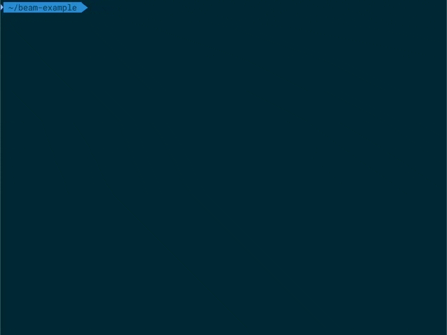

<h1 align="center">Welcome to Beam 👋</h1>

> A beautifully simple CLI for running Lighthouse audits on a statically generated (SSG) website.

Beam automates the process of testing a statically generated website during development by finding and testing the pages within your build directory. Beam strives to be simple-to-use with sensible defaults whilst allowing a range of useful options to customise it's behaviour to suit your needs.

Features:

- Interactive terminal GUI for viewing and exploring the Lighthouse audit results for each page.
- Supports Brotli compression so you can see the actual transfer sizes.
- Automatically crawls through your build folder to find all the pages to test.
- Glob patterns can be specified to customise the crawling results.
- Testing in `mobile`, `desktop`, or both Lighthouse presets.
- Ability to set page Media features (such as `prefers-color-scheme`).
- Ability to specify different Lighthouse options for each page.
- Save detailed Lighthouse reports to a folder of your choice.



## Prerequisites

- node ^14.13.1 || >=16.0.0

## Install

```sh
npm install --location=global beam-cli
```

## Usage

Please read the [getting started guide](docs/getting-started.md) for a more detailed guide.

### Initial Setup

```sh
beam --setup
```

### Run Beam

```sh
beam
```

### Additional Guides

- [CLI Flags](docs/cli-flags.md)
- [Configuration File Options](docs/configuration.md)
- [GUI Guide](docs/gui-guide.md)
- [Advanced Configuration](docs/advanced.md)

## Author

👤 **Mark Silverwood**

- Website: [marksilverwood.com](https://marksilverwood.com)
- Github: [@SlicedSilver](https://github.com/SlicedSilver)

## 🤝 Contributing

Contributions, issues and feature requests are welcome!<br />Feel free to check [issues page](issues). You can also take a look at the [contributing guide](CONTRIBUTING.md).

## Show your support

Give a ⭐️ if this project helped you!

## 📝 License

Copyright © 2022 [Mark Silverwood](https://github.com/SlicedSilver).<br />
This project is [MIT](/LICENSE.txt) licensed.

---

_This README was generated with ❤️ by [readme-md-generator](https://github.com/kefranabg/readme-md-generator)_
